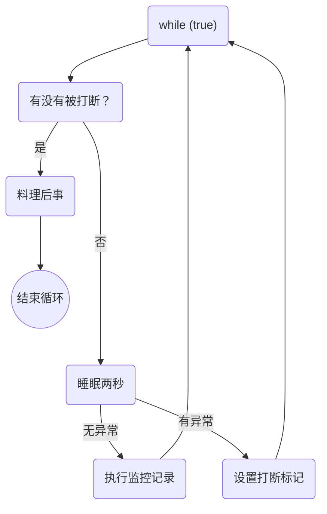

本篇文章主要介绍常见的设计模式，并用Java实现。

## 代理模式

使用代理对象代替对真实对象的访问，这样可以在不修改源对象的基础上增加功能。

### 静态代理

静态代理中，对目标对象的每个方法的增强都是手动完成的，接口新增方法，源对象和代理对象都要改变，用处很少。静态在编译时，就将接口，实现类，代理对象生成了时间的class文件。

[代码实例](https://github.com/YangZhang-dev/knojava/blob/master/designPattern/src/main/java/com/zzys/Proxy/staticProxy/TestStaticProxy.java)

### 动态代理

相比于静态代理来说，动态代理更加灵活。我们不需要针对每个目标类都单独创建一个代理类，并且也不需要我们必须实现接口，我们可以直接代理实现类( *CGLIB 动态代理机制*)。

从 JVM 角度来说，动态代理是在运行时动态生成类字节码，并加载到 JVM 中的。

#### JDK动态代理

[代码示例](https://github.com/YangZhang-dev/knojava/blob/master/designPattern/src/main/java/com/zzys/Proxy/dynamicProxy/jdkProxy/TestJDKProxy.java)

#### CGLIB动态代理

[代码示例](https://github.com/YangZhang-dev/knojava/blob/master/designPattern/src/main/java/com/zzys/Proxy/dynamicProxy/cglibProxy/TestCglibProxy.java)

#### JDK 动态代理和 CGLIB 动态代理对比

1. **JDK 动态代理只能代理实现了接口的类或者直接代理接口，而 CGLIB 可以代理未实现任何接口的类。** 另外， CGLIB 动态代理是通过生成一个被代理类的子类来拦截被代理类的方法调用，因此不能代理声明为 final 类型的类和方法。
2. 就二者的效率来说，大部分情况都是 JDK 动态代理更优秀，随着 JDK 版本的升级，这个优势更加明显。

### 静态代理和动态代理的对比

1. **灵活性**：动态代理更加灵活，不需要必须实现接口，可以直接代理实现类，并且可以不需要针对每个目标类都创建一个代理类。另外，静态代理中，接口一旦新增加方法，目标对象和代理对象都要进行修改，这是非常麻烦的！
2. **JVM 层面**：静态代理在编译时就将接口、实现类、代理类这些都变成了一个个实际的 class 文件。而动态代理是在运行时动态生成类字节码，并加载到 JVM 中。

## 两阶段终止模式

主要是用来优雅的终止线程，相较于stop方法，可以给线程处理后事的机会。

 - stop 方法会真正杀死线程，如果这时线程锁住了共享资源，那么当它被杀死后就再也没有机会释放锁，其它线程将永远无法获取锁
- 使用 System.exit(int) 方法停止线程，目的仅是停止一个线程，但这种做法会让整个程序都停止。

### 通过interrupt实现

思路是在线程中起一个死循环，通过是否被打断来判断是否停止并处理后事，没有被打断就运行后面的代码最后进入睡眠，避免占用过高的cpu。try-catch捕获`InterruptedException` ，设置打断标记位。流程图如下：

