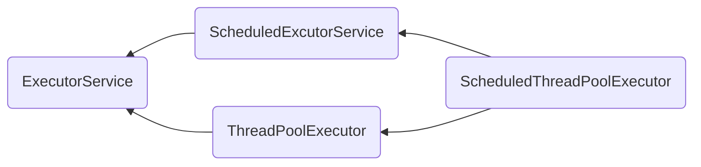

## 进程与线程

### 进程和线程

进程：可以视为程序的一个实例，当一个程序被运行，从磁盘加载这个程序的代码至内存，这时就开启了一个进程。 

线程：一个进程之内可以分为一到多个线程。一个线程就是一个指令流，将指令流中的一条条指令以一定的顺序交给 CPU 执行 

**区别**：

- 进程间通信较为复杂，线程通信相对简单，因为它们共享进程内的内存。
- 线程更轻量，线程上下文切换成本一般上要比进程上下文切换低
- 进程基本上相互独立的，而线程存在于进程内，是进程的一个子集 

### 并发和并行

- 单核CPU下：线程实际还是 `串行执行` 的。通过任务调度器，将CPU的时间片分给不同线程使用。微观串行，宏观并行。这就是并发。
- 多核CPU下：每个 `核（core）` 都可以调度运行线程，这时候线程可以是并行的。

### 应用

#### 异步调用

以调用方角度来讲，如果 

- 需要等待结果返回，才能继续运行就是同步 
- 不需要等待结果返回，就能继续运行就是异步 

#### 提升效率

充分利用多核 cpu 的优势，提高运行效率。想象下面的场景，执行 3 个计算，最后将计算结果汇总。

```plain
计算 1 花费 10 ms
计算 2 花费 11 ms
计算 3 花费 9 ms
汇总需要 1 ms
```

- 如果是串行执行，那么总共花费的时间是 10 + 11 + 9 + 1 = 31ms 
- 但如果是四核 cpu，各个核心分别使用线程 1 执行计算 1，线程 2 执行计算 2，线程 3 执行计算 3，那么 3 个 线程是并行的，花费时间只取决于最长的那个线程运行的时间，即 11ms最后加上汇总时间只会花费 12ms 

## Java线程

### 创建运行线程

[创建线程的方法](https://github.com/YangZhang-dev/knojava/tree/master/juc/src/main/java/com/zzys/CreateThread.java)

使用Runnable和匿名内部类的区别：

- 匿名内部类是把线程和任务合并在了一起，Runnable是把线程和任务分开了 
- 用 Runnable 更容易与线程池等高级 API 配合 
- 用 Runnable 让任务类脱离了 Thread 继承体系，更灵活

### 线程运行的原理

#### 栈与栈帧

Java Virtual Machine Stacks （Java 虚拟机栈）

我们都知道 JVM 中由堆、栈、方法区所组成，其中栈内存是给谁用的呢？其实就是线程，每个线程启动后，虚拟 机就会为其分配一块栈内存。

- 每个栈由多个栈帧（Frame）组成，对应着每次方法调用时所占用的内存
- 每个线程只能有一个活动栈帧，对应着当前正在执行的那个方法


关于栈与栈帧的理解，可以看这篇文章：csapp-03 程序的机器级表示(2)#1.1 运行时栈

#### 线程上下文切换（Thread Context Switch）

因为以下一些原因导致 cpu 不再执行当前的线程，转而执行另一个线程的代码
- 线程的 cpu 时间片用完
- 垃圾回收
- 有更高优先级的线程需要运行
- 线程自己调用了 sleep、yield、wait、join、park、synchronized、lock 等方法

当 Context Switch 发生时，需要由操作系统保存当前线程的状态，并恢复另一个线程的状态，Java 中对应的概念就是程序计数器（Program Counter Register），它的作用是记住下一条 jvm 指令的执行地址，是线程私有的
- 状态包括程序计数器、虚拟机栈中每个栈帧的信息，如局部变量、操作数栈、返回地址等
- Context Switch 频繁发生会影响性能

###  Thread类常见方法


### start vs run

- 直接调用 run 是在主线程中执行了 run，没有启动新的线程
- 使用 start 是启动新的线程，通过新的线程间接执行 run 中的代码

### sleep vs yield

**sleep**

- 调用 sleep 会让当前线程从 _Running_进入 _Timed Waiting_ 状态（阻塞）
- 其它线程可以使用 interrupt 方法打断正在睡眠的线程，这时 sleep 方法会抛出 InterruptedException
- 睡眠结束后的线程未必会立刻得到执行
- 建议用 TimeUnit 的 sleep 代替 Thread 的 sleep 来获得更好的可读性

**yield**

- 调用 yield 会让当前线程从 _Running_ 进入 _Runnable_就绪状态，然后调度执行其它线程
- 具体的实现依赖于操作系统的任务调度器

**线程优先级**

- 线程优先级会提示（hint）调度器优先调度该线程，但它仅仅是一个提示，调度器可以忽略它
- 如果 cpu 比较忙，那么优先级高的线程会获得更多的时间片，但 cpu 闲时，优先级几乎没作用

#### 应用

**sleep 实现**

在没有利用 cpu 来计算时，不要让 while(true) 空转浪费 cpu，这时可以使用 yield 或 sleep 来让出 cpu 的使用权 给其他程序

```java
while(true) {
    try {
        Thread.sleep(50);
    } catch (InterruptedException e) {
        e.printStackTrace();
    }
}
```

- 可以用 wait 或 条件变量达到类似的效果
- 不同的是，后两种都需要加锁，并且需要相应的唤醒操作，一般适用于要进行同步的场景
- sleep 适用于无需锁同步的场景

**wait实现**

```java
synchronized(锁对象) {
    while(条件不满足) {
        try {
            锁对象.wait();
        } catch(InterruptedException e) {
            e.printStackTrace();
        }
    }
    // do sth...
}
```

**条件变量实现**

```java
lock.lock();
try {
    while(条件不满足) {
        try {
            条件变量.await();
        } catch (InterruptedException e) {
            e.printStackTrace();
        }
    }
    // do sth...
} finally {
    lock.unlock();
}
```

### join

```java
static int r = 0;
public static void main(String[] args) throws InterruptedException {
    test1();
}

private static void test1() throws InterruptedException {
    log.debug("开始");
    Thread t1 = new Thread(() -> {
        log.debug("开始");
        sleep(1);
        log.debug("结束");
        r = 10;
    });
    t1.start();
    t1.join();
    log.debug("结果为:{}", r);
    log.debug("结束");
}
```
 在main线程中使用t1的join方法，会阻塞main方法的执行，等待t1的结束。如果加上参数，则表示最多等待时间。

### interrupt

#### 打断阻塞状态的线程

即wait,sleep,join。线程会抛出`InterruptedException`异常。并且isInterrupted为`false`。

#### 打断正常运行的线程

isInterrupted为`true`。

### 主线程和守护线程

默认情况下，Java 进程需要等待所有线程都运行结束，才会结束。有一种特殊的线程叫做守护线程，只要其它非守护线程运行结束了，即使守护线程的代码没有执行完，也会强制结束。

设置守护线程的方法
```java
Thread t3 = new Thread(() -> log.debug("t3 running"), "t3");
t3.setDaemon(true);
```

> - 垃圾回收器线程就是一种守护线程
> - Tomcat 中的 Acceptor 和 Poller 线程都是守护线程，所以 Tomcat 接收到 shutdown 命令后，不会等待它们处理完当前请求

### 操作系统层面的五种状态

- 【初始状态】仅是在语言层面创建了线程对象，还未与操作系统线程关联

- 【可运行状态】（就绪状态）指该线程已经被创建（与操作系统线程关联），可以由 CPU 调度执行

- 【运行状态】指获取了 CPU 时间片运行中的状态， 当 CPU 时间片用完，会从【运行状态】转换至【可运行状态】，会导致线程的上下文切换

- 【阻塞状态】如果调用了阻塞 API，如 BIO 读写文件，这时该线程实际不会用到 CPU，会导致线程上下文切换，进入【阻塞状态】，等 BIO 操作完毕，会由操作系统唤醒阻塞的线程，转换至【可运行状态】。与【可运行状态】的区别是，对【阻塞状态】的线程来说只要它们一直不唤醒，调度器就一直不会考虑调度它们

- 【终止状态】表示线程已经执行完毕，生命周期已经结束，不会再转换为其它状态

### java层面的六种状态

- `NEW`线程刚被创建，但是还没有调用 `start()` 方法
- `RUNNABLE` 当调用了 `start()` 方法之后，注意，**Java API** 层面的 `RUNNABLE` 状态涵盖了 **操作系统** 层面的【可运行状态】、【运行状态】和【阻塞状态】（由于 BIO 导致的线程阻塞，在 Java 里无法区分，仍然认为是可运行）
- `BLOCKED ， WAITING ， TIMED_WAITING` 都是 **Java API** 层面对【阻塞状态】的细分，后面会在状态转换一节详述
- `TERMINATED` 当线程代码运行结束

## 共享模型之管程

关注访问共享变量时，保证临界区代码的原子性的问题。

### 共享的问题

####  临界区 Critical Section

- 一个程序运行多个线程本身是没有问题的
- 问题出在多个线程访问**共享资源**，多个线程读**共享资源**其实也没有问题， 在多个线程对**共享资源**读写操作时发生指令交错，就会出现问题
- 一段代码块内如果存在对**共享资源**的多线程读写操作，称这段代码块为**临界区**

#### 竞态条件 Race Condition

多个线程在临界区内执行，由于代码的**执行序列不同**而导致结果无法预测，称之为发生了**竞态条件**

#### 解决方案

为了避免临界区的竞态条件发生，有多种手段可以达到目的。

- 阻塞式的解决方案：synchronized，Lock
- 非阻塞式的解决方案：原子变量

### synchronized解决方案

俗称【对象锁】，它采用互斥的方式让同一时刻至多只有一个线程能持有【对象锁】，其它线程再想获取这个【对象锁】时就会阻塞住。这样就能保证拥有锁的线程可以安全的执行临界区内的代码，不用担心线程上下文切换。

**方法上的synchronized**

```java
class Test{
    public synchronized void test() {

    }
}
等价于
class Test{
    public void test() {
        synchronized(this) {

        }
    }
}
```
静态方法

```java
class Test{
    public synchronized static void test() {
        
    }
}
等价于
class Test{
    public static void test() {
        synchronized(Test.class) {

        }
    }
}
```

线程synchronized锁问题：https://www.yuque.com/mo_ming/gl7b70/us5re3#fiqsd

### 变量的线程安全分析

**成员变量和静态变量是否线程安全？** 

- 如果它们没有共享，则线程安全 
- 如果它们被共享了，根据它们的状态是否能够改变，又分两种情况 

  - 如果只有读操作，则线程安全 
  - 如果有读写操作，则这段代码是临界区，需要考虑线程安全 

**局部变量是否线程安全？** 

- 局部变量是线程安全的 
- 但局部变量引用的对象则未必 

  - 如果该对象没有逃离方法的作用访问，它是线程安全的 
  - 如果该对象逃离方法的作用范围，需要考虑线程安全

### 常见的线程安全类

- String 
- Integer 
- StringBuffer 
- Random 
- Vector 
- Hashtable 
- java.util.concurrent 包下的类

它们的每个方法是原子的，但**注意**它们多个方法的组合不是原子的。

### 不可变类线程安全性 

String、Integer 等都是不可变类，因为其内部的状态不可以改变，因此它们的方法都是线程安全的 

例题测试线程安全掌握程度：https://www.yuque.com/mo_ming/gl7b70/mtmcnh#Em0Wl


### Monitor

#### Java对象头

**普通对象**


**数组对象**


**Mark Word结构（64位）**


从上到下是普通状态，偏移锁状态，轻量级锁，重量级锁，GC标记。

#### Moitor原理（重量级锁）

翻译为**监视器**或**管程**。每个 Java 对象都可以关联一个 Monitor 对象，如果使用 synchronized 给对象上锁（重量级）之后，该对象头的Mark Word 中就被设置指向 Monitor 对象的指针。上图中Heavyweight Locked状态下的ptr_to_heavyweight_monitor指针即为指向Monitor对象的指针。 


#### 锁升级

##### 轻量级锁

轻量级锁的使用场景：如果一个对象虽然有多线程要**加锁**，但加锁的时间是**错开**的（也就是没有竞争），那么可以使用轻量级锁来优化。 轻量级锁对使用者是透明的，即语法仍然是 `synchronized` 。

加锁过程：

1. 创建 **锁记录**（Lock Record）对象，每个线程的栈帧都会包含一个锁记录的结构，内部可以存储锁定对象的Mark Word。

   

2. 让锁记录中 Object reference 指向锁对象，并尝试用 cas 替换 Object 的 Mark Word，将 Mark Word 的值存入锁记录

   

3. 如果 **cas** 替换成功，对象头中存储了 `锁记录地址和状态 00 `，表示由该线程给对象加锁，这时图示如下

   

4. 如果 cas 失败，有两种情况 ：

   - 如果是其它线程已经持有了该 Object 的轻量级锁，这时表明有竞争，会考虑自旋（存疑），失败后进入**锁膨胀**过程 
   - 如果是自己执行了 synchronized **锁重入**，那么再添加一条 Lock Record 作为重入的计数

   

5. 当退出 synchronized 代码块（解锁时）如果有取值为 null 的锁记录，表示有重入，这时重置锁记录，表示重入计数减一

   

6. 当退出 synchronized 代码块（解锁时）锁记录的值不为 null，这时使用 cas 将 Mark Word 的值恢复给对象头
   - 成功，则解锁成功 
   - 失败，说明轻量级锁进行了锁膨胀或已经升级为重量级锁，进入重量级锁解锁流程


##### 自旋优化 

重量级锁竞争的时候，还可以使用自旋(**循环**尝试获取重量级锁)来进行优化，如果当前线程自旋成功（即这时候持锁线程已经退出了同步块，释放了锁），这时当前线程就可以避免阻塞。 (进入阻塞再恢复,会发生上下文切换,比较耗费性能)。

轻量级加锁失败了自旋。期望在自旋的时间内获得锁，如果还是不能获得，那么开始膨胀，修改为重量级锁（存疑）。

##### 偏向锁

问题：轻量级锁在没有竞争时（就自己这个线程），每次重入仍然需要执行 CAS 操作。 

Java 6 中引入了偏向锁来做进一步优化：只有第一次使用 CAS 将线程 ID 设置到对象的 Mark Word 头，之后发现这个线程 ID 是自己的就表示没有竞争，不用重新 CAS。以后只要不发生竞争，这个对象就归该线程所有。这里的线程id是操作系统赋予的id 和 Java中Thread的id是不同的。

###### 偏向状态

对应于Mark Word中，如果最后三位为`101`即开启偏向锁，jvm默认开启。

偏向锁是默认是延迟的，不会在程序启动时立即生效，如果想避免延迟，可以加 VM 参数 `-XX:BiasedLockingStartupDelay=0` 来`禁用延迟` 。VM 参数 `-XX:-UseBiasedLocking` ` 禁用偏向锁`

如果没有开启偏向锁，那么对象创建后，markword 值为 0x01 即最后 3 位为 001，这时它的 hashcode、age 都为 0，第一次用到 hashcode 时才会赋值。

###### 撤销偏向锁

1. 调用hashCode()，原因：开启偏向锁后将无法记录hashCode值，所以会将其升级为轻量级锁，随后改为不可偏向锁状态。
2. 当有其它线程使用偏向锁对象时，会将偏向锁升级为轻量级锁，随后改为不可偏向状态。
3. 调用 wait/notify，原因：只有重量级锁才支持。

###### 批量重偏向

当(某类型对象)撤销偏向锁阈值超过 **20** 次后，jvm 会这样觉得，我是不是偏向错了呢，于是会在给(**所有这种类型的状态为偏向锁**的)对象加锁时重新偏向至新的加锁线程。

###### 批量撤销

当撤销偏向锁阈值超过 40 次后，jvm 会这样觉得，自己确实偏向错了，根本就不该偏向。于是**整个类的所有对象**都会变为不可偏向的，新建的该类型对象也是不可偏向的。即后对象头的三位为`001`。

##### 锁消除

JIT优化字节码后对一些没有必要的锁进行消除。如对局部对象上锁。

##### 锁膨胀

指的是**偏向锁**膨胀为**轻量级锁**再膨胀到**重量级锁**的过程。偏向锁在撤销偏向锁后会膨胀，轻量级锁加锁失败会膨胀为重量级锁。

[JAVA锁的膨胀过程和优化](https://www.cnblogs.com/aspirant/p/11705068.html)

### wait/notify

#### api

- `obj.wait()` 让进入 object 监视器的线程到 waitSet 等待 
- `obj.notify()` 在 object 上正在 waitSet 等待的线程中挑一个唤醒 
- `obj.notifyAll()` 让 object 上正在 waitSet 等待的线程全部唤醒

它们都是线程之间进行协作的手段，都属于 Object 对象的方法。必须获得此对象的锁（synchronized），才能调用这几个方法，

#### sleep和wait的区别

-  sleep 是 Thread 方法，而 wait 是 Object 的方法 
- sleep 不需要强制和 synchronized 配合使用，但 wait 需要和 synchronized 一起用 
-  sleep 在睡眠的同时，不会释放对象锁的，但 wait 在等待的时候会释放对象锁 
-  它们状态都是TIMED_WAITING

#### wait的正确使用

```java
synchronized(锁对象) {
    // 多线程条件
    while(条件不满足) {
        try {
            锁对象.wait();
        } catch(InterruptedException e) {
            e.printStackTrace();
        }
    }
    // do sth...
}
```

### Park&UnPark

#### Api

```java
Thread t1 = new Thread(() -> {
    log.debug("start...");
    sleep(1);
    log.debug("park...");
    LockSupport.park();
    log.debug("resume...");
},"t1");
t1.start();

sleep(2);
log.debug("unpark...");
LockSupport.unpark(t1);
```

#### 特点

与 Object 的 wait & notify 相比 

- wait，notify 和 notifyAll 必须配合 Object Monitor 一起使用，而 park，unpark 不必
- park & unpark 是以线程为单位来【阻塞】和【唤醒】线程，而 notify 只能随机唤醒一个等待线程，notifyAll是唤醒所有等待线程，就不那么【精确】 
- park & unpark 可以先 unpark，而 wait & notify 不能先 notify 

#### 原理

每个线程都有自己的一个(C代码实现的) Parker 对象，由三部分组成 `_counter` ， `_cond` 和`_mutex` 。

1. 调用park
   - 如果couter为1，无事发生。
   - 如果counter为0，那么进入wait
2. 调用unpark
   - 如果线程在wait，取消wait
   - 如果在运行，那么设counter为1

初始线程中的Parker对象中的 _counter = 0 和 _cond 为空。

### 状态转换


每一种都对应一种情况或一种方法：[重新理解线程状态转换](https://www.yuque.com/mo_ming/gl7b70/lom0gb#VDbl7)

### 多把锁

多把锁即将锁的粒度细分 

- 好处，是可以增强并发度 
- 坏处，如果一个线程需要同时获得多把锁，就容易发生死锁

### 活跃性

在引入多把锁后，多个线程就有可能会对多个锁进行抢占，那么会出现以下情况：

#### 死锁

一个线程需要同时获取多把锁，这时就容易发生死锁 ，一个线程拿到A锁，需要B锁，一个线程拿到B锁等待A锁。

注意：

- 避免死锁要注意加锁顺序 
- 另外如果由于某个线程进入了死循环，导致其它线程一直等待，对于这种情况 linux 下可以通过 top 先定位到CPU 占用高的 Java 进程，再利用 `top -Hp 进程id` 来定位是哪个线程，最后再用 jstack 排查

#### 活锁

活锁出现在两个线程互相改变对方的结束条件，最后谁也无法结束。

#### 饥饿

一个线程由于优先级太低，始终得不到 CPU 调度执行，也不能够结束。死锁中的顺序加锁有可能引入饥饿的问题。

### ReentrantLock

相对于 synchronized 它具备如下特点 

- 可中断 
- 可以设置超时时间 
- 可以设置为公平锁 
- 支持多个条件变量 

#### 可重入

可重入是指同一个线程如果首次获得了这把锁，那么因为它是这把锁的拥有者，因此有权利再次获取这把锁 

如果是不可重入锁，那么第二次获得锁时，自己也会被锁挡住。

```java
static ReentrantLock lock = new ReentrantLock();

public static void main(String[] args) {
    method1();
}

public static void method1() {
    lock.lock();
    try {
        log.debug("execute method1");
        method2();
    } finally {
        lock.unlock();
    }
}

public static void method2() {
    lock.lock();
    try {
        log.debug("execute method2");
        method3();
    } finally {
        lock.unlock();
    }
}

public static void method3() {
    lock.lock();
    try {
        log.debug("execute method3");
    } finally {
        lock.unlock();
    }
}

```

#### 可打断

在等待锁的过程中可以被打断，如果是不可中断模式，那么即使使用了 interrupt 也不会让等待中断

```java
ReentrantLock lock = new ReentrantLock();

Thread t1 = new Thread(() -> {
    log.debug("启动...");
    
    try {
        //没有竞争就会获取锁
        //有竞争就进入阻塞队列等待,但可以被打断
        lock.lockInterruptibly();
        //lock.lock(); //不可打断
    } catch (InterruptedException e) {
        e.printStackTrace();
        log.debug("等锁的过程中被打断");
        return;
    }
    
    try {
        log.debug("获得了锁");
    } finally {
        lock.unlock();
    }
}, "t1");

lock.lock();
log.debug("获得了锁");
t1.start();

try {
    sleep(1);
    log.debug("执行打断");
    t1.interrupt();
} finally {
    lock.unlock();
}
```

#### 可超时

在竞争锁时，不会一直阻塞。会立即返回或等一段时间后返回。

```java
ReentrantLock lock = new ReentrantLock();

Thread t1 = new Thread(() -> {
    log.debug("启动...");
    
    try {
        // 如果是无参则立即返回
        if (!lock.tryLock(1, TimeUnit.SECONDS)) {
            log.debug("获取等待 1s 后失败，返回");
            return;
        }
    } catch (InterruptedException e) {
        e.printStackTrace();
    }
    try {
        log.debug("获得了锁");
    } finally {
        lock.unlock();
    }
}, "t1");

lock.lock();
log.debug("获得了锁");
t1.start();

try {
    sleep(2);
} finally {
    lock.unlock();
}
```

#### 公平锁

公平: 先来就能先执行

不公平: 不保证先来就先执行

ReentrantLock默认是不公平的，在构造函数中传入true即可返回一个公平锁。公平锁一般没有必要，会降低并发度。

#### 多条件变量

ReentrantLock 的条件变量比 synchronized 强大之处在于，它是支持多个条件变量的，这就好比 

- synchronized 是那些不满足条件的线程都在一间休息室等消息 
- 而 ReentrantLock 支持多间休息室，有专门等烟的休息室、专门等早餐的休息室、唤醒时也是按休息室来唤醒 

使用流程

- await 前需要获得锁 
- await 执行后，会释放锁，进入 conditionObject 等待 
- await 的线程被唤醒（或打断、或超时）去重新竞争 lock 锁 
- 竞争 lock 锁成功后，从 await 后继续执行 

```java
ReentrantLock lock = new ReentrantLock(); // 创建一把锁
Condition condition = lock.newCondition();  // 创建一个该锁的条件变量
condition.await(); // 等待，释放锁
condition.signal(); // 唤醒
```


## 共享模型之内存

关注共享变量在多线程间的【可见性】问题与多条指令执行时的【有序性】问题 。

### Java内存模型

JMM 即 Java Memory Model，它定义了**主存**、**工作内存**抽象概念，底层对应着 CPU 寄存器、缓存、硬件内存、CPU 指令优化等。 

JMM 体现在以下几个方面 

- 原子性 - 保证指令不会受到线程上下文切换的影响 
- 可见性 - 保证指令不会受 cpu 缓存的影响 
- 有序性 - 保证指令不会受 cpu 指令并行优化的影响

### 可见性

#### 问题

t 线程刚开始从主内存读取了 run 的值到工作内存。 因为 t 线程要频繁从主内存中读取 run 的值，JIT 编译器会将 run 的值缓存至自己工作内存中的高速缓存中，减少对主存中 run 的访问，提高效率。1 秒之后，main 线程修改了 run 的值，并同步至主存，而 t 是从自己工作内存中的高速缓存中读取这个变量的值，结果永远是旧值。


#### 解决办法

**volatile**（易变关键字） 

它可以用来修饰成员变量和静态成员变量，他可以避免线程从自己的工作缓存中查找变量的值，必须到主存中获取它的值，线程操作 volatile 变量都是直接操作主存

#### 可见性VS原子性

可见性，它保证的是在多个线程之间，一个线程对 volatile 变量的修改对另一个线程可见，不能保证原子性，仅用在**一个写线程，多个读线程**的情况。synchronized 语句块既可以保证代码块的原子性，也同时保证代码块内变量的可见性。但缺点是 synchronized 是属于重量级操作，性能相对更低。

### 有序性

JVM 会在不影响正确性的前提下，可以调整语句的执行顺序，这种特性称之为『指令重排』，多线程下『指令重排』会影响正确性。

#### 原理之(CPU)指令级并行

实际上是基于CPU级的指令并行以及流水线技术，指令重排的前提是，重排指令不能影响结果。

#### 问题

在多线程下的JIT指令重排会出现问题： [诡异的结果](https://www.yuque.com/mo_ming/gl7b70/cpzl3l#DUAKw)。

#### 解决办法

volatile 修饰的变量，可以禁用指令重排

### 原理之volatile 

volatile 的底层实现原理是**内存屏障**，Memory Barrier（Memory Fence）

**可见性**

- 对 volatile 变量的写指令**后**会加入写屏障，写屏障（sfence）保证在该屏障之前的，对共享变量的改动，都同步到主存当中。
- 对 volatile 变量的读指令**前**会加入读屏障，而读屏障（lfence）保证在该屏障之后，对共享变量的读取，加载的是主存中最新数据。

**有序性**

- 写屏障会确保指令重排序时，不会将写屏障之前的代码排在写屏障之后。

- 读屏障会确保指令重排序时，不会将读屏障之后的代码排在读屏障之前。

注意：在屏障一边的代码还是有可能出现指令重排。

### happens-before原则

[happens-before](https://www.yuque.com/mo_ming/gl7b70/cpzl3l#emMHf)


本章和单例模式由很大的关系，很多实践如DSL都用到了volatile关键字。


## 共享模型之无锁

无锁即不使用锁来进行保护共享资源，可以同时使用CAS和volatile来确保线程安全。

### CAS与volatile

CAS即**compareAndSet**。其实 CAS 的底层是 `lock cmpxchg` 指令（X86 架构），在单核 CPU 和多核 CPU 下都能够保证【比较-交换】的原子性。在多核状态下，某个核执行到带 lock 的指令时，CPU 会让总线锁住，当这个核把此指令执行完毕，再开启总线。这个过程中不会被线程的调度机制所打断，保证了多个线程对内存操作的准确性，是原子的。

核心操作是：

```java
compareAndSet(prev, target);
```

该操作由操作系统来保证原子性。如果发现传入的旧值和当前的值不同，则返回false。

同时使用volatile保证共享变量对所有线程的可见性。CAS 必须借助 volatile 才能读取到共享变量的最新值来实现【比较并交换】的效果。

### 为什么无锁的效率高

synchronized 和 cas 没有绝对的谁效率高,要看所处的场景。

无锁情况下，即使重试失败，线程始终在高速运行，没有停歇，而 synchronized 会让线程在没有获得锁的时候，发生上下文切换，进入阻塞。上下文切换通常是很耗时间的。

### CAS的特点

- CAS 是基于**乐观锁**的思想：最乐观的估计，不怕别的线程来修改共享变量，就算改了也没关系，我吃亏点再重试呗。 
- synchronized 是基于**悲观锁**的思想：最悲观的估计，得防着其它线程来修改共享变量，我上了锁你们都别想改，我改完了解开锁，你们才有机会。 
- CAS 体现的是无锁并发、无阻塞并发，请仔细体会这两句话的意思 

  - 因为没有使用 synchronized，所以线程不会陷入阻塞，这是效率提升的因素之一 
  - 但如果竞争激烈，可以想到重试必然频繁发生，反而效率会受影响

### 原子整数

JUC：AtomicBoolean，AtomicInteger ，AtomicLong 

```java
AtomicInteger i = new AtomicInteger(0);

// 获取并自增（i = 0, 结果 i = 1, 返回 0），类似于 i++
System.out.println(i.getAndIncrement());

// 自增并获取（i = 1, 结果 i = 2, 返回 2），类似于 ++i
System.out.println(i.incrementAndGet());

// 自减并获取（i = 2, 结果 i = 1, 返回 1），类似于 --i
System.out.println(i.decrementAndGet());

// 获取并自减（i = 1, 结果 i = 0, 返回 1），类似于 i--
System.out.println(i.getAndDecrement());

// 获取并加值（i = 0, 结果 i = 5, 返回 0）
System.out.println(i.getAndAdd(5));

// 加值并获取（i = 5, 结果 i = 0, 返回 0）
System.out.println(i.addAndGet(-5));

// 获取并更新（i = 0, p 为 i 的当前值, 结果 i = -2, 返回 0）
// 其中函数中的操作能保证原子，但函数需要无副作用
System.out.println(i.getAndUpdate(p -> p - 2));

// 更新并获取（i = -2, p 为 i 的当前值, 结果 i = 0, 返回 0）
// 其中函数中的操作能保证原子，但函数需要无副作用
System.out.println(i.updateAndGet(p -> p + 2));

// 获取并计算（i = 0, p 为 i 的当前值, x 为参数1, 结果 i = 10, 返回 0）
// 其中函数中的操作能保证原子，但函数需要无副作用
// getAndUpdate 如果在 lambda 中引用了外部的局部变量，要保证该局部变量是 final 的
// getAndAccumulate 可以通过 参数1 来引用外部的局部变量，但因为其不在 lambda 中因此不必是 final
System.out.println(i.getAndAccumulate(10, (p, x) -> p + x));

// 计算并获取（i = 10, p 为 i 的当前值, x 为参数1, 结果 i = 0, 返回 0）
// 其中函数中的操作能保证原子，但函数需要无副作用
System.out.println(i.accumulateAndGet(-10, (p, x) -> p + x));
```

### 原子引用

JUC：AtomicReference，AtomicMarkableReference，AtomicStampedReference 

```java
public interface DecimalAccount {
    // 获取余额
    BigDecimal getBalance();
    
    // 取款
    void withdraw(BigDecimal amount);
    
    /**
    * 方法内会启动 1000 个线程，每个线程做 -10 元 的操作
    * 如果初始余额为 10000 那么正确的结果应当是 0
    */
    static void demo(DecimalAccount account) {
        List<Thread> ts = new ArrayList<>();
        for (int i = 0; i < 1000; i++) {
            ts.add(new Thread(() -> {
                account.withdraw(BigDecimal.TEN);
            }));
        }
        ts.forEach(Thread::start);
        
        ts.forEach(t -> {
            try {
                t.join();
            } catch (InterruptedException e) {
                e.printStackTrace();
            }
        });
        System.out.println(account.getBalance());
    }
    
}
class DecimalAccountSafeCas implements DecimalAccount {
    // 初始化一个原子引用
    AtomicReference<BigDecimal> ref;
    
    public DecimalAccountSafeCas(BigDecimal balance) {
        ref = new AtomicReference<>(balance);
    }
    
    @Override
    public BigDecimal getBalance() {
        return ref.get();
    }
    
    @Override
    public void withdraw(BigDecimal amount) {
        // CAS的思想，失败重试
        while (true) {
            BigDecimal prev = ref.get();
            BigDecimal next = prev.subtract(amount);
            if (ref.compareAndSet(prev, next)) {
                break;
            }
        }
    }
    
}
```

#### ABA问题

即不清楚是否已经由其他线程更改，只能判断值没变。主线程仅能判断出共享变量的值与最初值 A 是否相同，不能感知到这种从 A 改为 B 又 改回 A 的情况。

#### AtomicStampedReference

可以用来维护一个版本号。

```java
static AtomicStampedReference<String> ref = new AtomicStampedReference<>("A", 0);

public static void main(String[] args) throws InterruptedException {
    log.debug("main start...");
    // 获取值 A
    String prev = ref.getReference();
    // 获取版本号
    int stamp = ref.getStamp();
    log.debug("版本 {}", stamp);
    // 如果中间有其它线程干扰，发生了 ABA 现象
    other();
    sleep(1);
    // 尝试改为 C
    log.debug("change A->C {}", ref.compareAndSet(prev, "C", stamp, stamp + 1));
}

private static void other() {
    new Thread(() -> {
        log.debug("change A->B {}", ref.compareAndSet(ref.getReference(), "B", 
                                                      ref.getStamp(), ref.getStamp() + 1));
        log.debug("更新版本为 {}", ref.getStamp());
    }, "t1").start();
    
    sleep(0.5);
    
    new Thread(() -> {
        log.debug("change B->A {}", ref.compareAndSet(ref.getReference(), "A", 
                                                      ref.getStamp(), ref.getStamp() + 1));
        log.debug("更新版本为 {}", ref.getStamp());
    }, "t2").start();
}
```

#### AtomicMarkableReference

但是有时候，并不关心引用变量更改了几次，只是单纯的关心**是否更改过**，所以就有了 AtomicMarkableReference 

```java
@Slf4j
public class TestABAAtomicMarkableReference {
    public static void main(String[] args) throws InterruptedException {
        GarbageBag bag = new GarbageBag("装满了垃圾");
        // true表示初始版本
        AtomicMarkableReference<GarbageBag> ref = new AtomicMarkableReference<>(bag, true);
        
        log.debug("主线程 start...");
        GarbageBag prev = ref.getReference();
        log.debug(prev.toString());
        
        new Thread(() -> {
            log.debug("打扫卫生的线程 start...");
            bag.setDesc("空垃圾袋");
            while (!ref.compareAndSet(bag, bag, true, false)) {}
            log.debug(bag.toString());
        }).start();
        
        Thread.sleep(1000);
        log.debug("主线程想换一只新垃圾袋？");
        // 主要是看后两个参数，第一个是期待的版本，后面的是要更改的版本
        boolean success = ref.compareAndSet(prev, new GarbageBag("空垃圾袋"), true, false);
        log.debug("换了么？" + success);
        
        log.debug(ref.getReference().toString());
    }
}
```

### 原子类型

#### 原子数组

AtomicIntegerArray，AtomicLongArray，AtomicReferenceArray 

```java
AtomicIntegerArray<Integer> array = new AtomicIntegerArray(10)
array.length();
array.getAndIncrement(index);
```

#### 字段原子更新器  AtomicXXXFieldUpdater

AtomicReferenceFieldUpdater，AtomicIntegerFieldUpdater，AtomicLongFieldUpdater 

利用字段更新器，可以针对对象的某个域（Field）进行原子操作，只能配合 volatile 修饰的字段使用，

```java
public class Test5 {
    private volatile int field;
    
    public static void main(String[] args) {
        AtomicIntegerFieldUpdater fieldUpdater =AtomicIntegerFieldUpdater.newUpdater(Test5.class, "field");
        
        Test5 test5 = new Test5();
        fieldUpdater.compareAndSet(test5, 0, 10);
        // 修改成功 field = 10
        System.out.println(test5.field);
        // 修改成功 field = 20
        fieldUpdater.compareAndSet(test5, 10, 20);
        System.out.println(test5.field);
        // 修改失败 field = 20
        fieldUpdater.compareAndSet(test5, 10, 30);
        System.out.println(test5.field);
    }
}
```

#### 原子累加器

性能会高于AtomicInteger，但是精度不够，适用于高并发，并且不需要特别高精度的场景

```java
private static <T> void demo(Supplier<T> adderSupplier, Consumer<T> action) {
    T adder = adderSupplier.get();
    
    long start = System.nanoTime();
    
    List<Thread> ts = new ArrayList<>();
    // 4 个线程，每人累加 50 万
    for (int i = 0; i < 40; i++) {
        ts.add(new Thread(() -> {
            for (int j = 0; j < 500000; j++) {
                action.accept(adder);
            }
        }));
    }
    ts.forEach(t -> t.start());
    
    ts.forEach(t -> {
        try {
            t.join();
        } catch (InterruptedException e) {
            e.printStackTrace();
        }
    });
    long end = System.nanoTime();
    System.out.println(adder + " cost:" + (end - start)/1000_000);
}
```

性能提升的原因很简单，就是在有竞争时，设置多个累加单元，Therad-0 累加 Cell[0]，而 Thread-1 累加Cell[1]... 最后将结果汇总。这样它们在累加时操作的不同的 Cell 变量，因此减少了 CAS 重试失败，从而提高性能。

### Unsafe

取名Unsafe并不是说该类不安全,而是因为该类直接操作内存,比较复杂,意在告诉程序员使用该类有较大风险。

Unsafe 对象提供了非常底层的，操作内存、线程的方法，Unsafe 对象不能直接调用，只能通过反射获得。

```java
public class UnsafeAccessor {
    static Unsafe unsafe;
    static {
        try { 
            Field theUnsafe = Unsafe.class.getDeclaredField("theUnsafe");
            theUnsafe.setAccessible(true);
            unsafe = (Unsafe) theUnsafe.get(null);
        } catch (NoSuchFieldException | IllegalAccessException e) {
            throw new Error(e);
        }
    }
    static Unsafe getUnsafe() {
        return unsafe;
    }
}

// 测试
public class TestUnsafeCAS {

    public static void main(String[] args) throws NoSuchFieldException, IllegalAccessException {

//        Field theUnsafe = Unsafe.class.getDeclaredField("theUnsafe");
//        theUnsafe.setAccessible(true);
//        Unsafe unsafe = (Unsafe) theUnsafe.get(null);
        Unsafe unsafe = UnsafeAccessor.getUnsafe();
        System.out.println(unsafe);

        // 1. 获取域的偏移地址
        long idOffset = unsafe.objectFieldOffset(Teacher.class.getDeclaredField("id"));
        long nameOffset = unsafe.objectFieldOffset(Teacher.class.getDeclaredField("name"));

        Teacher t = new Teacher();
        System.out.println(t);

        // 2. 执行 cas 操作
        unsafe.compareAndSwapInt(t, idOffset, 0, 1);
        unsafe.compareAndSwapObject(t, nameOffset, null, "张三");

        // 3. 验证
        System.out.println(t);
    }
}

@Data
class Teacher {
    volatile int id;
    volatile String name;
}
```

## 共享模型之不可变

共享且可变的资源、共享且不可变的资源在多个线程安全的操作的结合下都会发生线程安全的问题。而不可变即将类设计为不对源类的属性进行改变，如需要改变就放回一个新的属性。

### 不可变的设计

类、类中所有属性都是 final 的 

- 属性用 final 修饰保证了该属性是只读的，不能修改 
- 类用 final 修饰保证了该类中的方法不能被覆盖，防止子类无意间破坏不可变性 

### 保护性拷贝（defensive copy）

以String类为例，构造新字符串对象时，会生成新的 char[] value，对内容进行复制 。这种通过创建副本对象来避免共享的手段称之为【保护性拷贝（defensive copy）】

```java
public String substring(int beginIndex) {
    if (beginIndex < 0) {
        throw new StringIndexOutOfBoundsException(beginIndex);
    }
    int subLen = value.length - beginIndex;
    if (subLen < 0) {
        throw new StringIndexOutOfBoundsException(subLen);
    }
    return (beginIndex == 0) ? this : new String(value, beginIndex, subLen);
}

public String(char value[], int offset, int count) {
    if (offset < 0) {
        throw new StringIndexOutOfBoundsException(offset);
    }
    if (count <= 0) {
        if (count < 0) {
            throw new StringIndexOutOfBoundsException(count);
        }
        if (offset <= value.length) {
            this.value = "".value;
            return;
        }
    }
    if (offset > value.length - count) {
        throw new StringIndexOutOfBoundsException(offset + count);
    }
    this.value = Arrays.copyOfRange(value, offset, offset+count);
}
```

### final原理

#### 设置final变量

加入写屏障，防止其他线程读到0。

#### 获取final变量

较小的值直接复制一份到栈内存中，大的复制到常量池中，Short.MAX_VALUE+1。

#### 匿名内部类访问的局部变量为什么必须要用final修饰

匿名内部类之所以可以访问局部变量，是因为在底层将这个局部变量的值传入到了匿名内部类中，并且以**匿名内部类的成员变量**的形式存在，这个值的传递过程是通过匿名内部类的构造器完成的。

用final修饰实际上就是为了**保护数据的一致性**。

因为将数据拷贝完成后，如果不用final修饰，则原先的局部变量可以发生变化。这里到了问题的核心了，如果局部变量发生变化后，匿名内部类是不知道的（因为他只是拷贝了局不变量的值，并不是直接使用的局部变量）。那么程序再接着运行下去，可能就会导致程序运行的结果与预期不同。

在JDK8中如果我们在匿名内部类中需要访问局部变量，那么这个局部变量不需要用final修饰符修饰。看似是一种编译机制的改变，实际上就是一个语法糖（底层还是帮你加了final）。但通过反编译没有看到底层为我们加上final，但我们无法改变这个局部变量的引用值，如果改变就会编译报错。

### 无状态

即无成员变量，因为成员变量保存的数据也可以称为状态信息，因此没有成员变量就称之为【无状态】。

在 web 阶段学习时，设计 Servlet 时为了保证其线程安全，都会有这样的建议，不要为 Servlet 设置成员变量，这 种没有任何成员变量的类是线程安全的 。


## 线程池

自定义线程池：[自定义线程池](https://github.com/YangZhang-dev/knojava)

### ThreadPoolExecutor



#### 线程池状态

ThreadPoolExecutor 使用 int 的高 3 位来表示线程池状态，低 29 位表示线程数量。


从数字上比较，TERMINATED > TIDYING > STOP > SHUTDOWN > RUNNING 。因为第一位是符号位,RUNNING 是负数,所以最小。

这些信息存储在一个原子变量 ctl 中，目的是将线程池状态与线程个数合二为一，这样就可以用一次 cas 原子操作进行赋值

```java
// c 为旧值， ctlOf 返回结果为新值
ctl.compareAndSet(c, ctlOf(targetState, workerCountOf(c))));

// rs 为高 3 位代表线程池状态， wc 为低 29 位代表线程个数，ctl 是合并它们
private static int ctlOf(int rs, int wc) { return rs | wc; }
```

#### 构造方法

```java
public ThreadPoolExecutor(int corePoolSize,
                          int maximumPoolSize,
                          long keepAliveTime,
                          TimeUnit unit,
                          BlockingQueue<Runnable> workQueue,
                          ThreadFactory threadFactory,
                         RejectedExecutionHandler handler)
```

- corePoolSize 核心线程数目 (最多保留的线程数) 
- maximumPoolSize 最大线程数目 
- keepAliveTime 生存时间 - 针对救急线程 
- unit 时间单位 - 针对救急线程 
- workQueue 阻塞队列 
- threadFactory 线程工厂 - 可以为线程创建时起个好名字 
- handler 拒绝策略

#### 工作方式

- 线程池中刚开始没有线程，当一个任务提交给线程池后，线程池会创建一个新线程来执行任务。 
- 当线程数达到 corePoolSize 并没有线程空闲，这时再加入任务，新加的任务会被加入workQueue 队列排队，直到有空闲的线程。 
- 如果队列选择了有界队列，那么任务超过了队列大小时，会创建 maximumPoolSize - corePoolSize 数目的线程来救急。 
- 如果线程到达 maximumPoolSize 仍然有新任务这时会执行拒绝策略。
- 当高峰过去后，超过corePoolSize 的救急线程如果一段时间没有任务做，需要结束节省资源，这个时间由keepAliveTime 和 unit 来控制。

#### 拒绝策略

jdk 提供了 4 种实现，其它著名框架也提供了实现。

- AbortPolicy 让调用者抛出 RejectedExecutionException 异常，这是默认策略
- CallerRunsPolicy 让调用者运行任务 
- DiscardPolicy 放弃本次任务 
- DiscardOldestPolicy 放弃队列中最早的任务，本任务取而代之 
- Dubbo 的实现，在抛出 RejectedExecutionException 异常之前会记录日志，并 dump 线程栈信息，方便定位问题 
- Netty 的实现，是创建一个新线程来执行任务 
- ActiveMQ 的实现，带超时等待（60s）尝试放入队列，类似我们之前自定义的拒绝策略 
- PinPoint 的实现，它使用了一个拒绝策略链，会逐一尝试策略链中每种拒绝策略  

### Executors类工厂方法

#### newFixedThreadPool

```java
public static ExecutorService newFixedThreadPool(int nThreads) {
    return new ThreadPoolExecutor(nThreads, nThreads,
                                  0L, TimeUnit.MILLISECONDS,
                                  new LinkedBlockingQueue<Runnable>());
}
```

特点 

- 核心线程数 == 最大线程数（没有救急线程被创建），因此也无需超时时间 
- 阻塞队列是无界的，可以放任意数量的任务 

>  **评价** 适用于任务量已知，相对耗时的任务

#### newCachedThreadPool

```java
public static ExecutorService newCachedThreadPool() {
    return new ThreadPoolExecutor(0, Integer.MAX_VALUE,
                                  60L, TimeUnit.SECONDS,
                                  new SynchronousQueue<Runnable>());
}
```

特点 

- 核心线程数是 0，最大线程数是 Integer.MAX_VALUE，救急线程的空闲生存时间是 60s，意味着 

- - 全部都是救急线程（60s 后可以回收）
  - 救急线程可以无限创建 

- 队列采用了 SynchronousQueue 实现特点是，它没有容量，没有线程来取是放不进去的（一手交钱、一手交货）

> **评价** 整个线程池表现为线程数会根据任务量不断增长，没有上限，当任务执行完毕，空闲 1分钟后释放线程。 适合任务数比较密集，但每个任务执行时间较短的情况

#### newSingleThreadExecutor

```java
public static ExecutorService newSingleThreadExecutor() {
    return new FinalizableDelegatedExecutorService
        (new ThreadPoolExecutor(1, 1,
                                0L, TimeUnit.MILLISECONDS,
                                new LinkedBlockingQueue<Runnable>()));
}
```

使用场景： 

希望多个任务排队执行。线程数固定为 1，任务数多于 1 时，会放入无界队列排队。任务执行完毕，这唯一的线程也不会被释放。 


> 和自己创建一个线程来工作的区别: 

- 自己创建一个单线程串行执行任务，如果任务执行失败而终止那么没有任何补救措施，而线程池还会新建一个线程，保证池的正常工作 

>  和Executors.newFixedThreadPool(1)的区别

- Executors.newSingleThreadExecutor() 线程个数始终为1，不能修改 

- - FinalizableDelegatedExecutorService 应用的是装饰器模式，只对外暴露了 ExecutorService 接口，因此不能调用 ThreadPoolExecutor 中特有的方法 

- Executors.newFixedThreadPool(1) 初始时为1，以后还可以修改 

- - 对外暴露的是 ThreadPoolExecutor 对象，可以强转后调用 setCorePoolSize 等方法进行修改

### 线程池方法

**提交任务**

```java
// 执行任务
void execute(Runnable command);

// 提交任务 task，用返回值 Future 获得任务执行结果
<T> Future<T> submit(Callable<T> task);

// 提交 tasks 中所有任务
<T> List<Future<T>> invokeAll(Collection<? extends Callable<T>> tasks)
    throws InterruptedException;

// 提交 tasks 中所有任务，带超时时间
<T> List<Future<T>> invokeAll(Collection<? extends Callable<T>> tasks,
                              long timeout, TimeUnit unit)
    throws InterruptedException;

// 提交 tasks 中所有任务，哪个任务先成功执行完毕，返回此任务执行结果，其它任务取消
<T> T invokeAny(Collection<? extends Callable<T>> tasks)
    throws InterruptedException, ExecutionException;

// 提交 tasks 中所有任务，哪个任务先成功执行完毕，返回此任务执行结果，其它任务取消，带超时时间
<T> T invokeAny(Collection<? extends Callable<T>> tasks,
                long timeout, TimeUnit unit)
 throws InterruptedException, ExecutionException, TimeoutException;
```

**关闭线程池**

```java
/*
线程池状态变为 SHUTDOWN
- 不会接收新任务
- 但已提交任务会执行完
- 此方法不会阻塞调用线程的执行
*/
void shutdown();

public void shutdown() {
    final ReentrantLock mainLock = this.mainLock;
    mainLock.lock();
    try {
        checkShutdownAccess();
        // 修改线程池状态
        advanceRunState(SHUTDOWN);
        // 仅会打断空闲线程
        interruptIdleWorkers();
        onShutdown(); // 扩展点 ScheduledThreadPoolExecutor
    } finally {
        mainLock.unlock();
    }
    // 尝试终结(没有运行的线程可以立刻终结，如果还有运行的线程也不会等)
    tryTerminate();
}

/*
线程池状态变为 STOP
- 不会接收新任务
- 会将队列中的任务返回
- 并用 interrupt 的方式中断正在执行的任务
*/
List<Runnable> shutdownNow();

public List<Runnable> shutdownNow() {
    List<Runnable> tasks;
    final ReentrantLock mainLock = this.mainLock;
    mainLock.lock();
    try {
        checkShutdownAccess();
        // 修改线程池状态
        advanceRunState(STOP);
        // 打断所有线程
        interruptWorkers();
        // 获取队列中剩余任务
        tasks = drainQueue();
    } finally {
        mainLock.unlock();
    }
    // 尝试终结
    tryTerminate();
    return tasks; 
}
```

**其他方法**

```java
// 不在 RUNNING 状态的线程池，此方法就返回 true
boolean isShutdown();

// 线程池状态是否是 TERMINATED
boolean isTerminated();

// 调用 shutdown 后，由于调用线程并不会等待所有任务运行结束，因此如果它想在线程池 TERMINATED 后做些事情，可以利用此方法等待
boolean awaitTermination(long timeout, TimeUnit unit) throws InterruptedException;
```

### 创建线程的数量

**CPU 密集型运算** 

通常采用 `cpu 核数 + 1` 能够实现最优的 CPU 利用率，+1 是保证当线程由于页缺失故障（操作系统）或其它原因 导致暂停时，额外的这个线程就能顶上去，保证 CPU 时钟周期不被浪费 

**I/O 密集型运算** 

CPU 不总是处于繁忙状态，例如，当你执行业务计算时，这时候会使用 CPU 资源，但当你执行 I/O 操作时、远程 RPC 调用时，包括进行数据库操作时，这时候 CPU 就闲下来了，你可以利用多线程提高它的利用率。 

经验公式如下 

```
线程数 = 核数 * 期望 CPU 利用率 * 总时间(CPU计算时间+等待时间) / CPU 计算时间
```

例如 4 核 CPU 计算时间是 50% ，其它等待时间是 50%，期望 cpu 被 100% 利用，套用公式 

```
4 * 100% * 100% / 50% = 8 
```

例如 4 核 CPU 计算时间是 10% ，其它等待时间是 90%，期望 cpu 被 100% 利用，套用公式 

```
4 * 100% * 100% / 10% = 40 
```

CPU计算时间和等待时间需要对程序进行观测。


### 任务调度线程池

以前使用的java.util.Timer已经不推荐使用，一般使用ScheduledExecutorService。

```java
ScheduledExecutorService executor = Executors.newScheduledThreadPool(2);

// 添加两个任务，希望它们都在 1s 后执行，两个任务之间不会有影响
executor.schedule(() -> {
    System.out.println("任务1，执行时间：" + new Date());
    try { Thread.sleep(2000); } catch (InterruptedException e) { }
}, 1000, TimeUnit.MILLISECONDS);

executor.schedule(() -> {
    System.out.println("任务2，执行时间：" + new Date());
}, 1000, TimeUnit.MILLISECONDS);


// 第三个参数是多个任务开始之间的时间间隔，他会被任务执行时间所影响
log.debug("start...");
pool.scheduleAtFixedRate(() -> {
    log.debug("running...");
}, 1, 1, TimeUnit.SECONDS);

// 第三个参数是一个任务结束到第二个任务开始的时间间隔
log.debug("start...");
pool.scheduleWithFixedDelay(()-> {
    log.debug("running...");
    sleep(2);
}, 1, 1, TimeUnit.SECONDS);
```

### **执行任务异常** 

- 手动try-catch

- 使用 Future

  ```java
  ExecutorService pool = Executors.newFixedThreadPool(1);
  
  Future<Boolean> f = pool.submit(() -> {
      log.debug("task1");
      int i = 1 / 0;
      return true;
  });
  log.debug("result:{}", f.get());
  ```

### fork/join

实际上是分治思想的体现。

```java
public static void main(String[] args) {
    ForkJoinPool pool = new ForkJoinPool(4);
    System.out.println(pool.invoke(new AddTask3(1, 10)));
}

class AddTask3 extends RecursiveTask<Integer> {
    
    int begin;
    int end;
    
    public AddTask3(int begin, int end) {
        this.begin = begin;
        this.end = end;
    }
    
    @Override
    public String toString() {
        return "{" + begin + "," + end + '}';
    }
    
    @Override
    protected Integer compute() {
        // 5, 5
        if (begin == end) {
            log.debug("join() {}", begin);
            return begin;
        }
        // 4, 5
        if (end - begin == 1) {
            log.debug("join() {} + {} = {}", begin, end, end + begin);
            return end + begin;
        }
        
        // 1 5
        int mid = (end + begin) / 2; // 3
        AddTask3 t1 = new AddTask3(begin, mid); // 1,3
        t1.fork();
        AddTask3 t2 = new AddTask3(mid + 1, end); // 4,5
        t2.fork();
        log.debug("fork() {} + {} = ?", t1, t2);
        int result = t1.join() + t2.join();
        log.debug("join() {} + {} = {}", t1, t2, result);
        return result;
    }
}
```

## JUC

### AQS

全称是 AbstractQueuedSynchronizer，是阻塞式锁和相关的同步器工具的框架。

#### state属性 独占/共享模式

- 用 state 属性来表示资源的状态（分独占模式和共享模式），子类需要定义如何维护这个状态，控制如何获取锁和释放锁 ，使用的是cas+volatile

- - getState - 获取 state 状态 
  - setState - 设置 state 状态 
  - compareAndSetState - cas 机制设置 state 状态 
  - 独占模式是只有一个线程能够访问资源，而共享模式可以允许多个线程访问资源 

#### 等待队列

- 提供了基于 FIFO 的等待队列，类似于 Monitor 的 EntryList，使用的是park/unPark

#### 条件变量

- 条件变量来实现等待、唤醒机制，支持多个条件变量，类似于 Monitor 的 WaitSet 

#### 需要子类实现的方法

子类主要实现这样一些方法（默认抛出 UnsupportedOperationException） 

- tryAcquire 
- tryRelease 
- tryAcquireShared 
- tryReleaseShared 
- isHeldExclusively

#### 设计

```java
// 获取锁的设计
while(state 状态不允许获取) {
    if(队列中还没有此线程) {
        入队并阻塞
    }
}
当前线程出队
    
// 释放锁的设计
if(state 状态允许了) {
    恢复阻塞的线程(s) 
}
```

### ReentrantLock原理（理解）

图解的流程需要记住，源码看看即可。

#### 非公平锁实现原理 

```java
public ReentrantLock() {
   sync = new NonfairSync();
}
```

**没有竞争时(占有锁)**


**第一个竞争出现时(发生排队)**


Thread-1 执行了 

1. CAS 尝试将 state 由 0 改为 1，结果失败 

2. 进入 tryAcquire 逻辑，这时 state 已经是1，结果仍然失败 

3. 接下来进入 addWaiter 逻辑，构造 Node 队列 

- - 图中黄色三角表示该 Node 的 waitStatus 状态，其中 0 为默认正常状态 
  - Node 的创建是懒惰的 
  - 其中第一个 Node 称为 Dummy（哑元）或哨兵，用来占位，并不关联线程

- 

当前线程进入 acquireQueued 逻辑 

1. acquireQueued 会在一个死循环中不断尝试获得锁，失败后进入 park 阻塞 

2. 如果自己是紧邻着 head（排第二位），那么再次 tryAcquire 尝试获取锁，当然这时 state 仍为 1，失败 

3. 进入 shouldParkAfterFailedAcquire 逻辑，将前驱 node，即 head 的 waitStatus 改为 -1，这次返回 false


4. shouldParkAfterFailedAcquire 执行完毕回到 acquireQueued ，再次 tryAcquire 尝试获取锁，当然这时state 仍为 1，失败 

5. 当再次进入 shouldParkAfterFailedAcquire 时，这时因为其前驱 node 的 waitStatus 已经是 -1，这次返回true 

6. 进入 parkAndCheckInterrupt， Thread-1 park（灰色表示）


再次有多个线程经历上述过程竞争失败，变成这个样子


**原OwnerThread释放锁时**

Thread-0 释放锁，进入 tryRelease 流程，如果成功 

- 设置 exclusiveOwnerThread 为 null 
- state = 0


**队列内线程抢到锁**

当前队列不为 null，并且 head 的 waitStatus = -1，进入 unparkSuccessor 流程 

找到队列中离 head 最近的一个 Node（没取消的），unpark 恢复其运行，本例中即为 Thread-1 

回到 Thread-1 的 acquireQueued 流程


如果加锁成功（没有竞争），会设置 

- exclusiveOwnerThread 为 Thread-1，state = 1 
- head 指向刚刚 Thread-1 所在的 Node，该 Node 清空 Thread 
- 原本的 head 因为从链表断开，而可被垃圾回收 

**队列外线程抢到锁**

如果这时候有其它线程来竞争（非公平的体现），例如这时有 Thread-4 来了


#### 加锁源码

```java
// Sync 继承自 AQS
static final class NonfairSync extends Sync {
    private static final long serialVersionUID = 7316153563782823691L;
    
    // 加锁实现
    final void lock() {
        // 首先用 cas 尝试（仅尝试一次）将 state 从 0 改为 1, 如果成功表示获得了独占锁
        if (compareAndSetState(0, 1))
            setExclusiveOwnerThread(Thread.currentThread());
        else
            // 如果尝试失败，进入 ㈠
            acquire(1);
    }
    
    // ㈠ AQS 继承过来的方法, 方便阅读, 放在此处
    public final void acquire(int arg) {
        // ㈡ tryAcquire 
        if (
            !tryAcquire(arg) &&
            // 当 tryAcquire 返回为 false 时, 先调用 addWaiter ㈣, 接着 acquireQueued ㈤
            acquireQueued(addWaiter(Node.EXCLUSIVE), arg)
        ) {
            selfInterrupt();
        }
    }
    
    // ㈡ 进入 ㈢
    protected final boolean tryAcquire(int acquires) {
        return nonfairTryAcquire(acquires);
    }
    
    // ㈢ Sync 继承过来的方法, 方便阅读, 放在此处
    final boolean nonfairTryAcquire(int acquires) {
        final Thread current = Thread.currentThread();
        int c = getState();
        // 如果还没有获得锁
        if (c == 0) {
            // 尝试用 cas 获得, 这里体现了非公平性: 不去检查 AQS 队列
            if (compareAndSetState(0, acquires)) {
                setExclusiveOwnerThread(current);
                return true;
            }
        }
        // 如果已经获得了锁, 线程还是当前线程, 表示发生了锁重入
        else if (current == getExclusiveOwnerThread()) {
            // state++
            int nextc = c + acquires;
            if (nextc < 0) // overflow
                throw new Error("Maximum lock count exceeded");
            setState(nextc);
            return true;
        }
        // 获取失败, 回到调用处
        return false;
    }
    
    // ㈣ AQS 继承过来的方法, 方便阅读, 放在此处
    private Node addWaiter(Node mode) {
        // 将当前线程关联到一个 Node 对象上, 模式为独占模式
        Node node = new Node(Thread.currentThread(), mode);
        // 如果 tail 不为 null, cas 尝试将 Node 对象加入 AQS 队列尾部
        Node pred = tail;
        if (pred != null) {
            node.prev = pred;
            if (compareAndSetTail(pred, node)) {
                // 双向链表
                pred.next = node;
                return node;
            }
        }
        // 尝试将 Node 加入 AQS, 进入 ㈥
        enq(node);
        return node;
    }
    
    // ㈥ AQS 继承过来的方法, 方便阅读, 放在此处
    private Node enq(final Node node) {
        for (;;) {
            Node t = tail;
            if (t == null) {
                // 还没有, 设置 head 为哨兵节点（不对应线程，状态为 0）
                if (compareAndSetHead(new Node())) {
                    tail = head;
                }
            } else {
                // cas 尝试将 Node 对象加入 AQS 队列尾部
                node.prev = t;
                if (compareAndSetTail(t, node)) {
                    t.next = node;
                    return t;
                }
            }
        }
    }
    
    // ㈤ AQS 继承过来的方法, 方便阅读, 放在此处
    final boolean acquireQueued(final Node node, int arg) {
        boolean failed = true;
        try {
            boolean interrupted = false;
            for (;;) {
                final Node p = node.predecessor();
                // 上一个节点是 head, 表示轮到自己（当前线程对应的 node）了, 尝试获取
                if (p == head && tryAcquire(arg)) {
                    // 获取成功, 设置自己（当前线程对应的 node）为 head
                    setHead(node);
                    // 上一个节点 help GC
                    p.next = null;
                    failed = false;
                    // 返回中断标记 false
                    return interrupted;
                }
                if (
                    // 判断是否应当 park, 进入 ㈦
                    shouldParkAfterFailedAcquire(p, node) &&
                    // park 等待, 此时 Node 的状态被置为 Node.SIGNAL ㈧
                    parkAndCheckInterrupt()
                ) {
                    interrupted = true;
                }
            }
        } finally {
            if (failed)
                cancelAcquire(node);
        }
    }
    
    // ㈦ AQS 继承过来的方法, 方便阅读, 放在此处
    private static boolean shouldParkAfterFailedAcquire(Node pred, Node node) {
        // 获取上一个节点的状态
        int ws = pred.waitStatus;
        if (ws == Node.SIGNAL) {
            // 上一个节点都在阻塞, 那么自己也阻塞好了
            return true;
        }
        // > 0 表示取消状态
        if (ws > 0) {
            // 上一个节点取消, 那么重构删除前面所有取消的节点, 返回到外层循环重试
            do {
                node.prev = pred = pred.prev;
            } while (pred.waitStatus > 0);
            pred.next = node;
        } else {
            // 这次还没有阻塞
            // 但下次如果重试不成功, 则需要阻塞，这时需要设置上一个节点状态为 Node.SIGNAL
            compareAndSetWaitStatus(pred, ws, Node.SIGNAL);
        }
        return false;
    }
    
    // ㈧ 阻塞当前线程
    private final boolean parkAndCheckInterrupt() {
        LockSupport.park(this);
        return Thread.interrupted();
    }
}
```

#### 解锁源码

```java
// Sync 继承自 AQS
static final class NonfairSync extends Sync {
    // 解锁实现
    public void unlock() {
        sync.release(1);
    }
    
    // AQS 继承过来的方法, 方便阅读, 放在此处
    public final boolean release(int arg) {
        // 尝试释放锁, 进入 ㈠
        if (tryRelease(arg)) {
            // 队列头节点 unpark
            Node h = head; 
            if (
                // 队列不为 null
                h != null &&
                // waitStatus == Node.SIGNAL 才需要 unpark
                h.waitStatus != 0
            ) {
                // unpark AQS 中等待的线程, 进入 ㈡
                unparkSuccessor(h);
            }
            return true;
        }
        return false;
    }
    
    // ㈠ Sync 继承过来的方法, 方便阅读, 放在此处
    protected final boolean tryRelease(int releases) {
        // state--
        int c = getState() - releases;
        if (Thread.currentThread() != getExclusiveOwnerThread())
            throw new IllegalMonitorStateException();
        boolean free = false;
        // 支持锁重入, 只有 state 减为 0, 才释放成功
        if (c == 0) {
            free = true;
            setExclusiveOwnerThread(null);
        }
        setState(c);
        return free;
    }
    
    // ㈡ AQS 继承过来的方法, 方便阅读, 放在此处
    private void unparkSuccessor(Node node) {
        // 如果状态为 Node.SIGNAL 尝试重置状态为 0
        // 不成功也可以
        int ws = node.waitStatus;
        if (ws < 0) {
            compareAndSetWaitStatus(node, ws, 0);
        }
        // 找到需要 unpark 的节点, 但本节点从 AQS 队列中脱离, 是由唤醒节点完成的
        Node s = node.next;
        // 不考虑已取消的节点, 从 AQS 队列从后至前找到队列最前面需要 unpark 的节点
        if (s == null || s.waitStatus > 0) {
            s = null;
            for (Node t = tail; t != null && t != node; t = t.prev)
                if (t.waitStatus <= 0)
                    s = t;
        }
        if (s != null)
            LockSupport.unpark(s.thread);
    }
}
```

#### 可重入原理

```java
static final class NonfairSync extends Sync {
    // ...
    
    // Sync 继承过来的方法, 方便阅读, 放在此处
    final boolean nonfairTryAcquire(int acquires) {
        final Thread current = Thread.currentThread();
        int c = getState();
        if (c == 0) {
            if (compareAndSetState(0, acquires)) {
                setExclusiveOwnerThread(current);
                return true;
            }
        }
        // 如果已经获得了锁, 线程还是当前线程, 表示发生了锁重入
        else if (current == getExclusiveOwnerThread()) {
            // state++
            int nextc = c + acquires;
            if (nextc < 0) // overflow
                throw new Error("Maximum lock count exceeded");
            setState(nextc);
            return true;
        }
        return false;
    }
    
    // Sync 继承过来的方法, 方便阅读, 放在此处
    protected final boolean tryRelease(int releases) {
        // state-- 
        int c = getState() - releases;
        if (Thread.currentThread() != getExclusiveOwnerThread())
            throw new IllegalMonitorStateException();
        boolean free = false;
        // 支持锁重入, 只有 state 减为 0, 才释放成功
        if (c == 0) {
            free = true;
            setExclusiveOwnerThread(null);
        }
        setState(c);
        return free;
    }
}
```

#### 可打断原理

默认是不可打断：

```java
// Sync 继承自 AQS
static final class NonfairSync extends Sync {
    // ...
    
    private final boolean parkAndCheckInterrupt() {
        // 如果打断标记已经是 true, 则 park 会失效
        LockSupport.park(this);
        // interrupted 会清除打断标记
        return Thread.interrupted();
    }
    
    final boolean acquireQueued(final Node node, int arg) {
        boolean failed = true;
        try {
            boolean interrupted = false;
            for (;;) {
                final Node p = node.predecessor();
                if (p == head && tryAcquire(arg)) {
                    setHead(node);
                    p.next = null;
                    failed = false;
                    // 还是需要获得锁后, 才能返回打断状态
                    return interrupted;
                }
                if (
                    shouldParkAfterFailedAcquire(p, node) &&
                    parkAndCheckInterrupt()
                ) {
                    // 如果是因为 interrupt 被唤醒, 返回打断状态为 true
                    interrupted = true;
                }
            }
        } finally {
            if (failed)
                cancelAcquire(node);
        }
    }
    
    public final void acquire(int arg) {
        if (
            !tryAcquire(arg) &&
            acquireQueued(addWaiter(Node.EXCLUSIVE), arg)
        ) {
            // 如果打断状态为 true
            selfInterrupt();
        }
    }
    
    static void selfInterrupt() {
        // 重新产生一次中断
        Thread.currentThread().interrupt();
    }
}
```

可打断：

```java
static final class NonfairSync extends Sync {
    public final void acquireInterruptibly(int arg) throws InterruptedException {
        if (Thread.interrupted())
            throw new InterruptedException();
        // 如果没有获得到锁, 进入 ㈠
        if (!tryAcquire(arg))
            doAcquireInterruptibly(arg);
    }
    
    // ㈠ 可打断的获取锁流程
    private void doAcquireInterruptibly(int arg) throws InterruptedException {
        final Node node = addWaiter(Node.EXCLUSIVE);
        boolean failed = true;
        try {
            for (;;) {
                final Node p = node.predecessor();
                if (p == head && tryAcquire(arg)) {
                    setHead(node);
                    p.next = null; // help GC
                    failed = false;
                    return;
                }
                if (shouldParkAfterFailedAcquire(p, node) &&
                    parkAndCheckInterrupt()) {
                    // 在 park 过程中如果被 interrupt 会进入此
                    // 这时候抛出异常, 而不会再次进入 for (;;)
                    throw new InterruptedException();
                }
            }
        } finally {
            if (failed)
                cancelAcquire(node);
        }
    }
}
```

#### 公平锁原理

```java
static final class FairSync extends Sync {
    private static final long serialVersionUID = -3000897897090466540L;
    final void lock() {
        acquire(1);
    }
    
    // AQS 继承过来的方法, 方便阅读, 放在此处
    public final void acquire(int arg) {
        if (
            !tryAcquire(arg) &&
            acquireQueued(addWaiter(Node.EXCLUSIVE), arg)
        ) {
            selfInterrupt();
        }
    }
    // 与非公平锁主要区别在于 tryAcquire 方法的实现
    protected final boolean tryAcquire(int acquires) {
        final Thread current = Thread.currentThread();
        int c = getState();
        if (c == 0) {
            // 先检查 AQS 队列中是否有前驱节点, 没有才去竞争
            if (!hasQueuedPredecessors() &&
                compareAndSetState(0, acquires)) {
                setExclusiveOwnerThread(current);
                return true;
            }
        }
        else if (current == getExclusiveOwnerThread()) {
            int nextc = c + acquires;
            if (nextc < 0)
                throw new Error("Maximum lock count exceeded");
            setState(nextc);
            return true;
        }
        return false;
    }
    
    // ㈠ AQS 继承过来的方法, 方便阅读, 放在此处
    public final boolean hasQueuedPredecessors() {
        Node t = tail;
        Node h = head;
        Node s;
        // h != t 时表示队列中有 Node
        return h != t &&
            (
            // (s = h.next) == null 表示队列中还有没有老二
            (s = h.next) == null ||
            // 或者队列中老二线程不是此线程
            s.thread != Thread.currentThread()
        );
    }
}
```

#### 条件变量原理

每个条件变量其实就对应着一个等待队列，其实现类是 ConditionObject。

**await**

开始 Thread-0 持有锁，调用 await，进入 ConditionObject 的 addConditionWaiter 流程 。创建新的 Node 状态为 -2（Node.CONDITION），关联 Thread-0，加入等待队列尾部.


接下来进入 AQS 的 fullyRelease 流程，释放同步器上的锁。


unpark AQS 队列中的下一个节点，竞争锁，假设没有其他竞争线程，那么 Thread-1 竞争成功


park 阻塞 Thread-0


**signal 流程** 

假设 Thread-1 要来唤醒 Thread-0


进入 ConditionObject 的 doSignal 流程，取得等待队列中第一个 Node，即 Thread-0 所在 Node


执行 transferForSignal 流程，将该 Node 加入 AQS 队列尾部，将 Thread-0 的 waitStatus 改为 0，Thread-3 的waitStatus 改为 -1


**源码**

```java
public class ConditionObject implements Condition, java.io.Serializable {
    private static final long serialVersionUID = 1173984872572414699L;
    
    // 第一个等待节点
    private transient Node firstWaiter;
    
    // 最后一个等待节点
    private transient Node lastWaiter;
    public ConditionObject() { }
    // ㈠ 添加一个 Node 至等待队列
    private Node addConditionWaiter() {
        Node t = lastWaiter;
        // 所有已取消的 Node 从队列链表删除, 见 ㈡
        if (t != null && t.waitStatus != Node.CONDITION) {
            unlinkCancelledWaiters();
            t = lastWaiter;
        }
        // 创建一个关联当前线程的新 Node, 添加至队列尾部
        Node node = new Node(Thread.currentThread(), Node.CONDITION);
        if (t == null)
            firstWaiter = node;
        else
            t.nextWaiter = node;
        lastWaiter = node;
        return node;
    }
    // 唤醒 - 将没取消的第一个节点转移至 AQS 队列
    private void doSignal(Node first) {
        do {
            // 已经是尾节点了
            if ( (firstWaiter = first.nextWaiter) == null) {
                lastWaiter = null;
            }
            first.nextWaiter = null;
        } while (
            // 将等待队列中的 Node 转移至 AQS 队列, 不成功且还有节点则继续循环 ㈢
            !transferForSignal(first) &&
            // 队列还有节点
            (first = firstWaiter) != null
        );
    }
    
    // 外部类方法, 方便阅读, 放在此处
    // ㈢ 如果节点状态是取消, 返回 false 表示转移失败, 否则转移成功
    final boolean transferForSignal(Node node) {
        // 如果状态已经不是 Node.CONDITION, 说明被取消了
        if (!compareAndSetWaitStatus(node, Node.CONDITION, 0))
            return false;
        // 加入 AQS 队列尾部
        Node p = enq(node);
        int ws = p.waitStatus;
        if (
            // 上一个节点被取消
            ws > 0 ||
            // 上一个节点不能设置状态为 Node.SIGNAL
            !compareAndSetWaitStatus(p, ws, Node.SIGNAL) 
        ) {
            // unpark 取消阻塞, 让线程重新同步状态
            LockSupport.unpark(node.thread);
        }
        return true;
    }
    // 全部唤醒 - 等待队列的所有节点转移至 AQS 队列
    private void doSignalAll(Node first) {
        lastWaiter = firstWaiter = null;
        do {
            Node next = first.nextWaiter;
            first.nextWaiter = null;
            transferForSignal(first);
            first = next;
        } while (first != null);
    }
    
    // ㈡
    private void unlinkCancelledWaiters() {
        // ...
    }
    // 唤醒 - 必须持有锁才能唤醒, 因此 doSignal 内无需考虑加锁
    public final void signal() {
        if (!isHeldExclusively())
            throw new IllegalMonitorStateException();
        Node first = firstWaiter;
        if (first != null)
            doSignal(first);
    }
    // 全部唤醒 - 必须持有锁才能唤醒, 因此 doSignalAll 内无需考虑加锁
    public final void signalAll() {
        if (!isHeldExclusively())
            throw new IllegalMonitorStateException();
        Node first = firstWaiter;
        if (first != null)
            doSignalAll(first);
    }
    // 不可打断等待 - 直到被唤醒
    public final void awaitUninterruptibly() {
        // 添加一个 Node 至等待队列, 见 ㈠
        Node node = addConditionWaiter();
        // 释放节点持有的锁, 见 ㈣
        int savedState = fullyRelease(node);
        boolean interrupted = false;
        // 如果该节点还没有转移至 AQS 队列, 阻塞
        while (!isOnSyncQueue(node)) {
            // park 阻塞
            LockSupport.park(this);
            // 如果被打断, 仅设置打断状态
            if (Thread.interrupted())
                interrupted = true;
        }
        // 唤醒后, 尝试竞争锁, 如果失败进入 AQS 队列
        if (acquireQueued(node, savedState) || interrupted)
            selfInterrupt();
    }
    // 外部类方法, 方便阅读, 放在此处
    // ㈣ 因为某线程可能重入，需要将 state 全部释放
    final int fullyRelease(Node node) {
        boolean failed = true;
        try {
            int savedState = getState();
            if (release(savedState)) {
                failed = false;
                return savedState;
            } else {
                throw new IllegalMonitorStateException();
            }
        } finally {
            if (failed)
                node.waitStatus = Node.CANCELLED;
        }
    }
    // 打断模式 - 在退出等待时重新设置打断状态
    private static final int REINTERRUPT = 1;
    // 打断模式 - 在退出等待时抛出异常
    private static final int THROW_IE = -1;
    // 判断打断模式
    private int checkInterruptWhileWaiting(Node node) {
        return Thread.interrupted() ?
            (transferAfterCancelledWait(node) ? THROW_IE : REINTERRUPT) :
        0;
    }
    // ㈤ 应用打断模式
    private void reportInterruptAfterWait(int interruptMode)
        throws InterruptedException {
        if (interruptMode == THROW_IE)
            throw new InterruptedException();
        else if (interruptMode == REINTERRUPT)
            selfInterrupt();
    }
    // 等待 - 直到被唤醒或打断
    public final void await() throws InterruptedException {
        if (Thread.interrupted()) {
            throw new InterruptedException();
        }
        // 添加一个 Node 至等待队列, 见 ㈠
        Node node = addConditionWaiter();
        // 释放节点持有的锁
        int savedState = fullyRelease(node);
        int interruptMode = 0;
        // 如果该节点还没有转移至 AQS 队列, 阻塞
        while (!isOnSyncQueue(node)) {
            // park 阻塞
            LockSupport.park(this);
            // 如果被打断, 退出等待队列
            if ((interruptMode = checkInterruptWhileWaiting(node)) != 0)
                break;
        }
        // 退出等待队列后, 还需要获得 AQS 队列的锁
        if (acquireQueued(node, savedState) && interruptMode != THROW_IE)
            interruptMode = REINTERRUPT;
        // 所有已取消的 Node 从队列链表删除, 见 ㈡
        if (node.nextWaiter != null) 
            unlinkCancelledWaiters();
        // 应用打断模式, 见 ㈤
        if (interruptMode != 0)
            reportInterruptAfterWait(interruptMode);
    }
    // 等待 - 直到被唤醒或打断或超时
    public final long awaitNanos(long nanosTimeout) throws InterruptedException {
        if (Thread.interrupted()) {
            throw new InterruptedException();
        }
        // 添加一个 Node 至等待队列, 见 ㈠
        Node node = addConditionWaiter();
        // 释放节点持有的锁
        int savedState = fullyRelease(node);
        // 获得最后期限
        final long deadline = System.nanoTime() + nanosTimeout;
        int interruptMode = 0;
        // 如果该节点还没有转移至 AQS 队列, 阻塞
        while (!isOnSyncQueue(node)) {
            // 已超时, 退出等待队列
            if (nanosTimeout <= 0L) {
                transferAfterCancelledWait(node);
                break;
            }
            // park 阻塞一定时间, spinForTimeoutThreshold 为 1000 ns
            if (nanosTimeout >= spinForTimeoutThreshold)
                LockSupport.parkNanos(this, nanosTimeout);
            // 如果被打断, 退出等待队列
            if ((interruptMode = checkInterruptWhileWaiting(node)) != 0)
                break;
            nanosTimeout = deadline - System.nanoTime();
        }
        // 退出等待队列后, 还需要获得 AQS 队列的锁
        if (acquireQueued(node, savedState) && interruptMode != THROW_IE)
            interruptMode = REINTERRUPT;
        // 所有已取消的 Node 从队列链表删除, 见 ㈡
        if (node.nextWaiter != null)
            unlinkCancelledWaiters();
        // 应用打断模式, 见 ㈤
        if (interruptMode != 0)
            reportInterruptAfterWait(interruptMode);
        return deadline - System.nanoTime();
    }
    // 等待 - 直到被唤醒或打断或超时, 逻辑类似于 awaitNanos
    public final boolean awaitUntil(Date deadline) throws InterruptedException {
        // ...
    }
    // 等待 - 直到被唤醒或打断或超时, 逻辑类似于 awaitNanos
    public final boolean await(long time, TimeUnit unit) throws InterruptedException {
        // ...
    }
    // 工具方法 省略 ...
}
```


### 读写锁

#### ReentrantReadWriteLock

当读操作远远高于写操作时，这时候使用 `读写锁` 让 `读-读` 可以并发，提高性能。 类似于数据库中的 `select ... from ... lock in share mode`。

#### 特点

读读可并发，读写，写写互斥。

#### 原理

[ 读写锁 ](https://www.yuque.com/mo_ming/gl7b70/yuw120#E4YVv)
