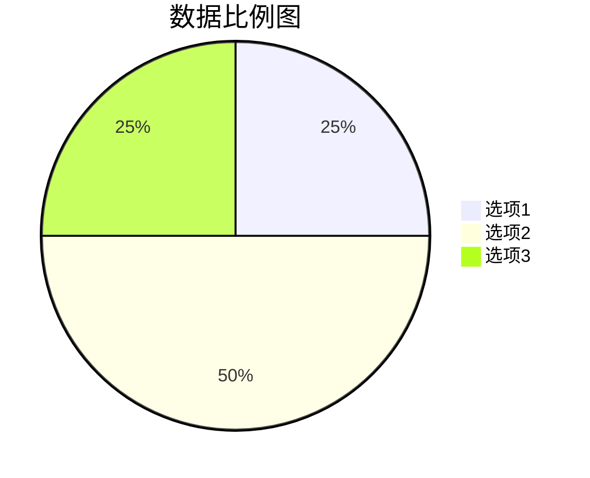
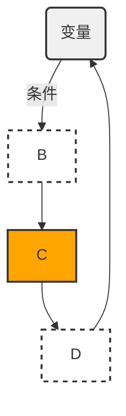
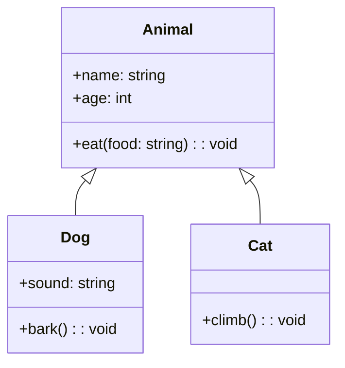

## 饼图

```mermaid
pie
title 数据比例图
"选项1" : 25
"选项2" : 50
"选项3" : 25 
```

## 流程图

LR即从左到右，TD即从上到下

```mermaid
graph TD
a("变量") --条件--> B --> C --> D --> a
style a fill:#F0F0F0,stroke:#333,stroke-width:2px;
style B fill:#FFF,stroke:#333,stroke-width:2px,stroke-dasharray: 5 5;
style C fill:#FFA500,stroke:#333,stroke-width:2px;
style D fill:#FFF,stroke:#333,stroke-width:2px,stroke-dasharray: 5 5; 
```

## 类图

```mermaid
classDiagram
class Animal {
        +name: string
        +age: int
        +eat(food: string): void
    }

class Dog {
        +sound: string
        +bark(): void
    }

class Cat {
        +climb(): void
    }

    Animal <|-- Dog
    Animal <|-- Cat
```